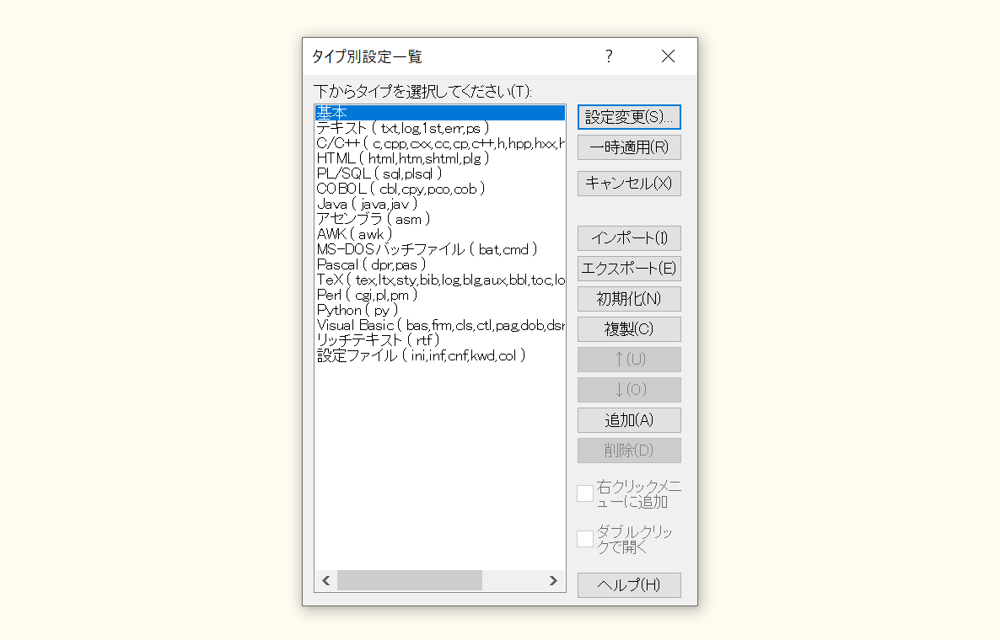
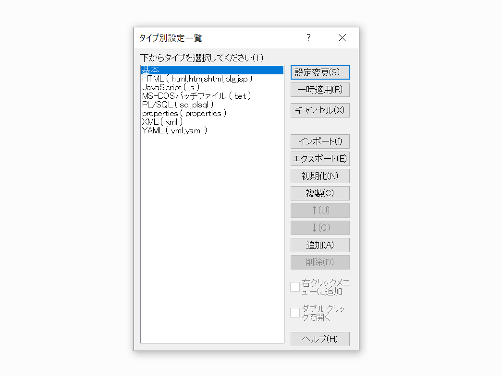

サクラエディタ 設定ファイル
====================

## sakura-gr

サクラエディタ Grep置換 のコマンドライン版


### アイコン変更

```
C:\Program Files (x86)\sakura
  ├ my_appicon.ico
  └ my_icons.bmp
```


### デフォルトの文字コードを UTF-8 にする

タイプ別にデフォルトの文字コードを設定できる。

設定(O) > タイプ別設定(Y) > 「ウィンドウ」タブ > 「デフォルトの文字コード」


### 設定変更が保存されない原因と解決方法

- https://zenn.dev/syon/articles/a62405f17bee97


## タイプ別設定



1. このダイアログにある「基本」以外をすべて消す
1. リポジトリ内「タイプ別設定」フォルダにあるものすべてインポート  
  ※「基本」は読込先を新規追加ではなく「基本」を選択し上書きする


